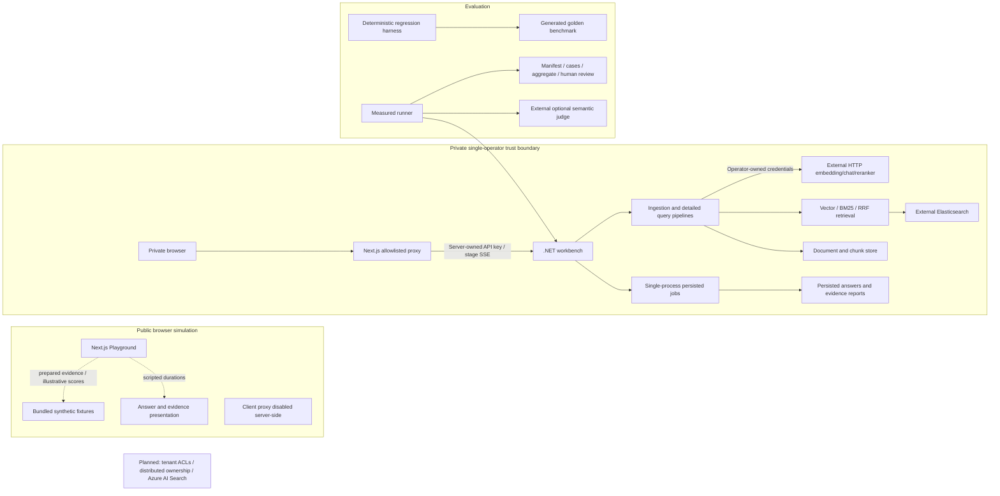

# Architecture and execution boundaries

Implementation status and execution mode are different. A backend adapter can be implemented
without being exercised by the public demo. Solid arrows below are implemented calls; dotted
arrows describe a simulation. External services are explicitly labeled.

The public browser never crosses into the private boundary. Browser history and persistent server
reports have separate retention. The API shared key authenticates an operator-level caller, not a
tenant. Corpus/profile IDs prevent retrieval mixing but do not authorize document access.

Ingestion resolves allowed sources, parses/normalizes content, chunks, embeds, writes documents and
vectors, removes obsolete chunks, then publishes the updated profile catalog. Cross-store writes
are not transactional. Interrupted ingestion leaves a non-ready profile and must be retried before
querying. Changing embedding identity requires a new profile.

Queries validate profile compatibility, embed the question, retrieve a candidate pool, optionally
fuse BM25 with vectors and rerank, admit context under a budget, generate an answer, then resolve
citation references. Resolution checks IDs in admitted context; it does not prove entailment.
The workbench abstains when no context is admitted. The legacy deterministic benchmark has a
separate harness abstention diagnostic.

Read the [five ADRs](adr/README.md) for choices and tradeoffs, and the
[operations runbook](operations.md) for supported limits and recovery.
